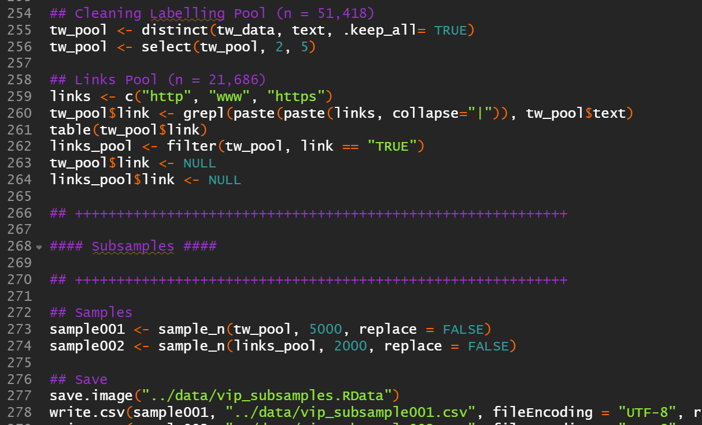
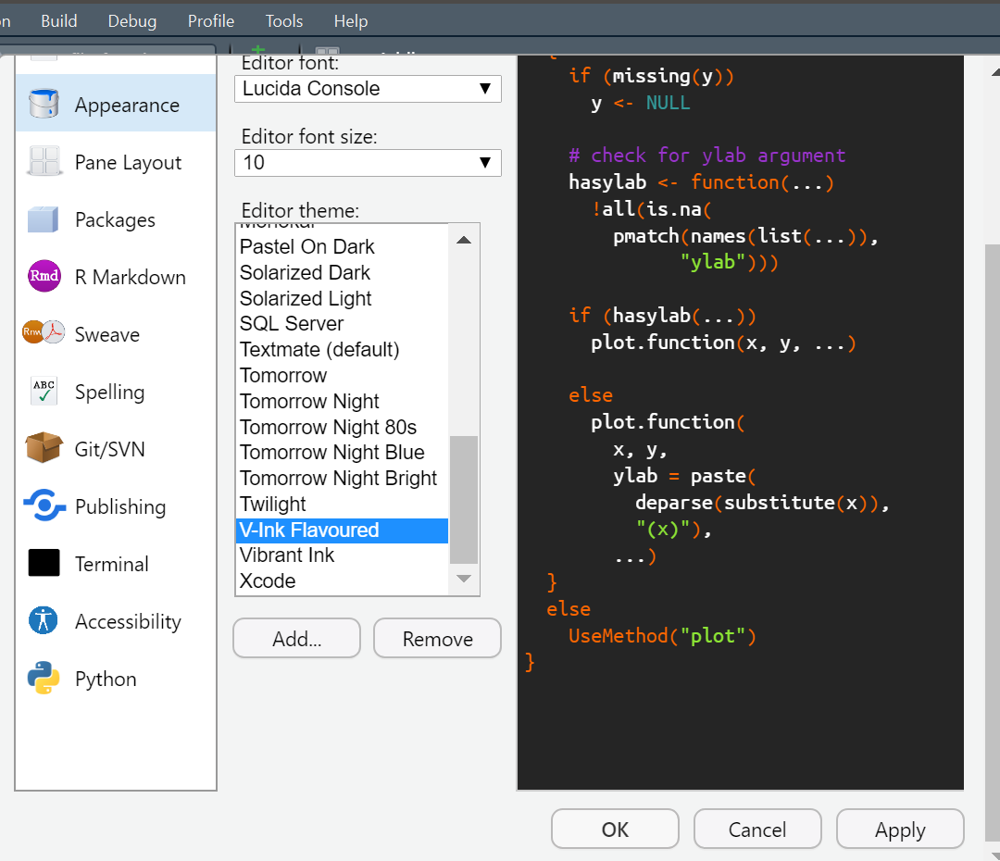

# v-ink-flavoured
**Vibrant Ink Flavoured RStudio Theme**

     

## Overview

## Metadata and Preservation

This theme is stored with version control on a GitHub repository. Furthermore, a Digital Object Identifier (DOI: TBC) is provided by Zenodo.

## Store and Backup

The GitHub repository has controlled access with Two-Factor Authentication (2FA) with two physical USB security devices (Bastián González-Bustamante, [ORCID iD 0000-0003-1510-6820](https://orcid.org/0000-0003-1510-6820)). Both USB keys issue one-time passwords to generate a cryptographic authentication FIDO 2 and U2F.

## Getting Started

### Software

WIP

### Setup Instructions

Please, follow the steps below:

- In the menu, select "Tools" and then "Global Options" at the bottom.
- From the left menu, select "Appearance" and import the **"V-Ink Flavoured.tmTheme"** file with the "Add..." button in the Editor theme section.
- I recommend using this template with "Modern" theme.

## License

This RStudio theme is released under a [Creative Commons Attribution 4.0 International license (CC BY 4.0)](LICENSE.md). This open-access license allows the data to be shared, reused, adapted as long as appropriate acknowledgement is given.

## Author

Bastián González-Bustamante \
bastian.gonzalezbustamante@politics.ox.ac.uk \
https://orcid.org/0000-0003-1510-6820 \
https://bgonzalezbustamante.com 

## CRediT - Contributor Roles Taxonomy

Bastián González-Bustamante ([ORCID iD 0000-0003-1510-6820](https://orcid.org/0000-0003-1510-6820)) \

   

### Latest Revision

[November 17, 2021](CHANGELOG.md).
